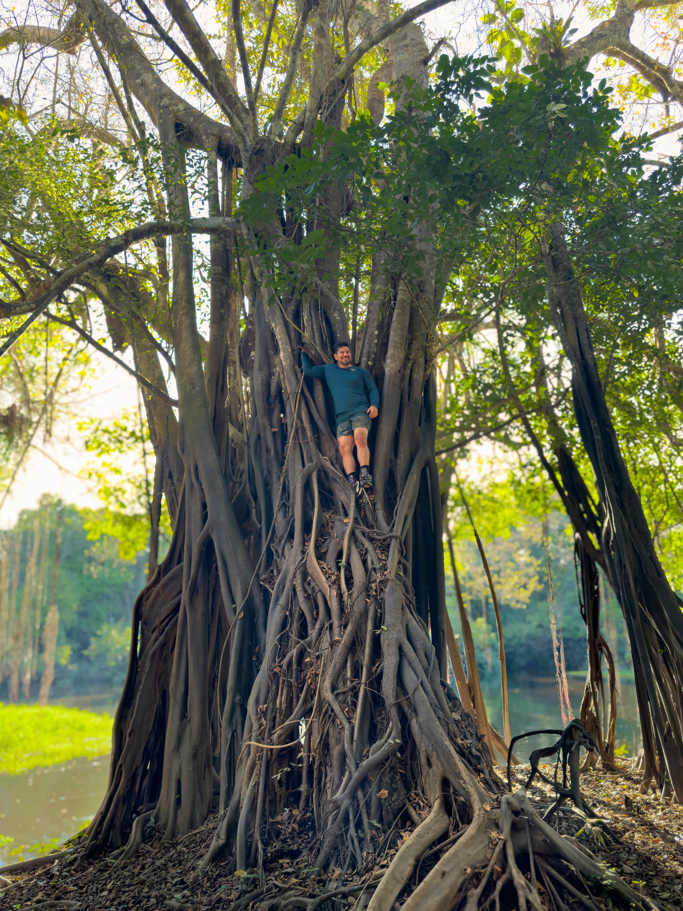
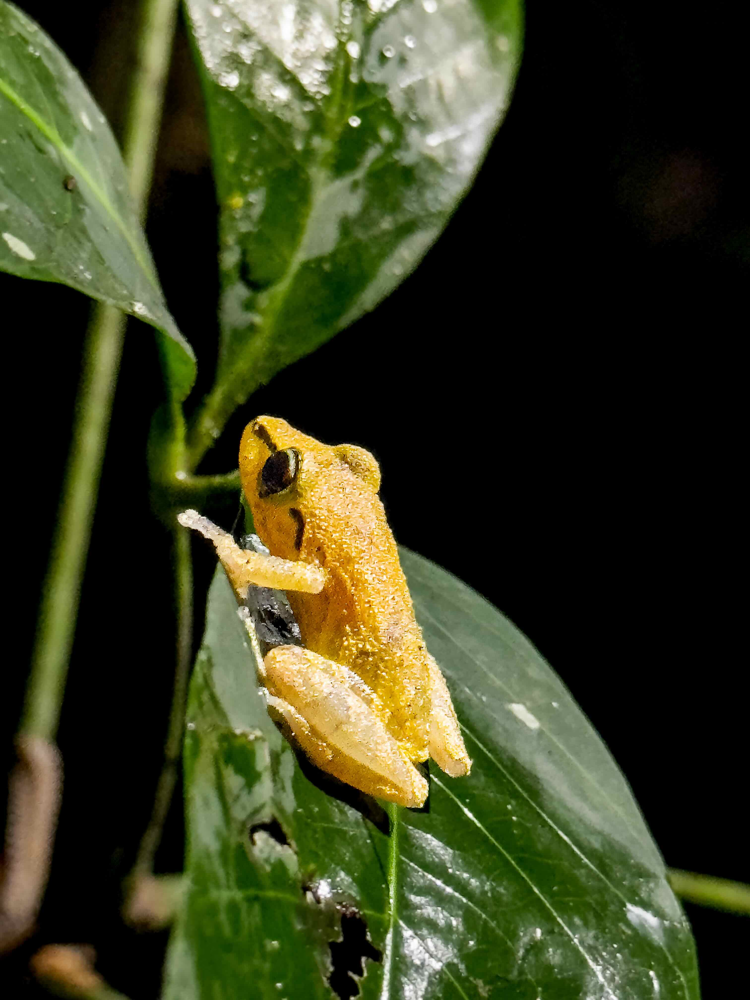
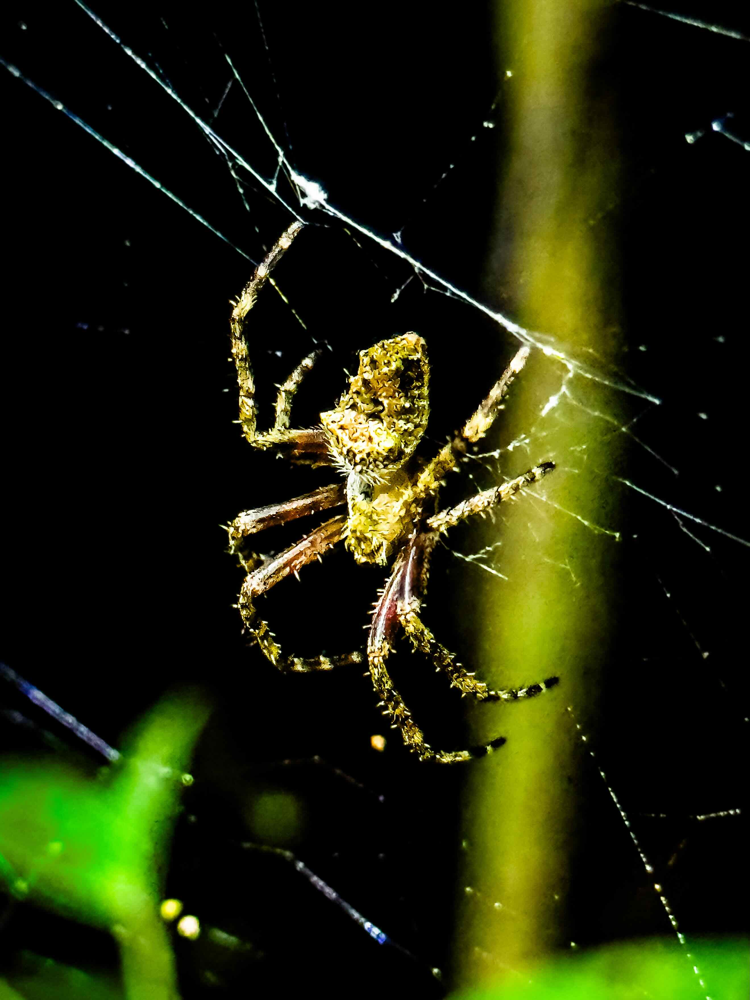
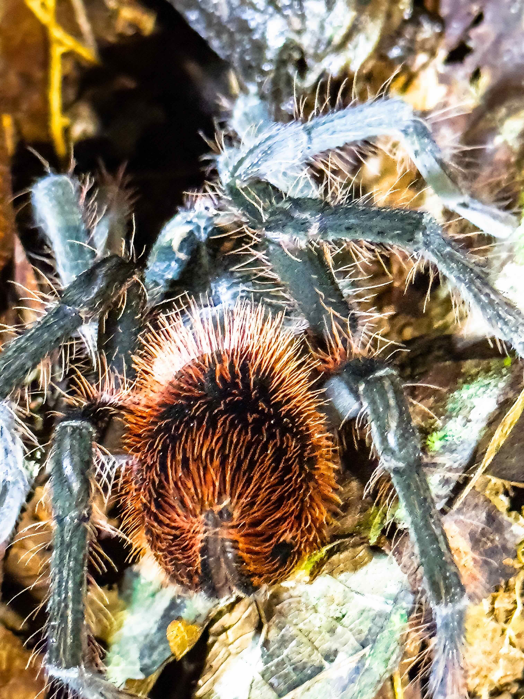
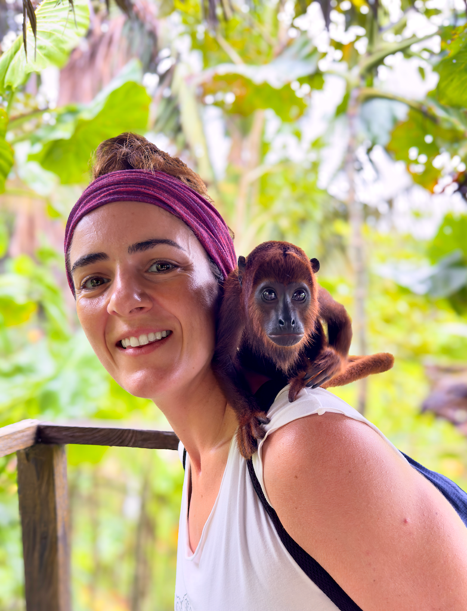
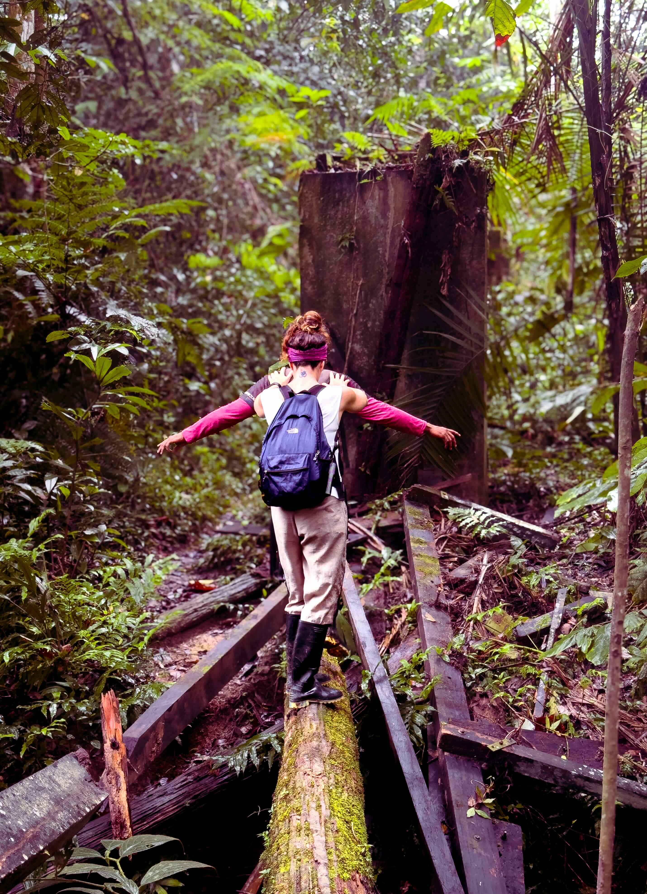
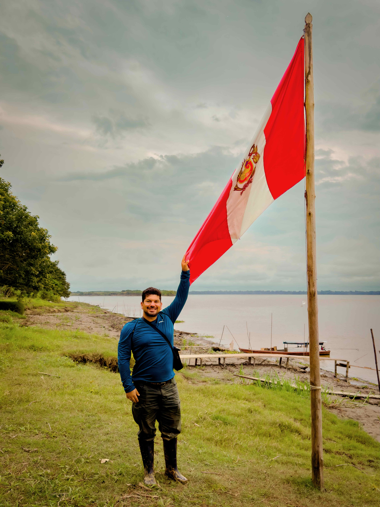
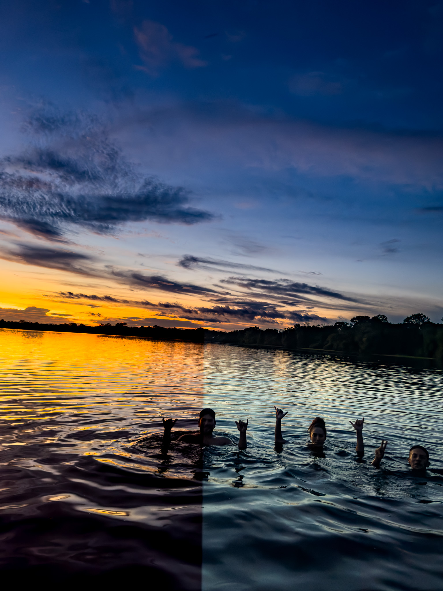
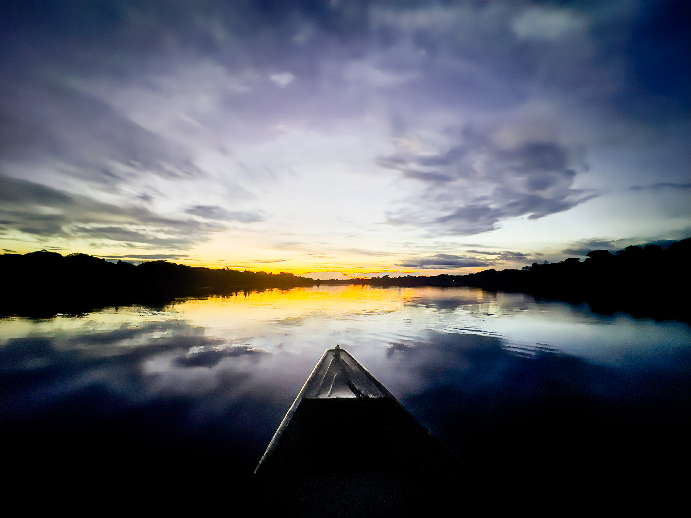
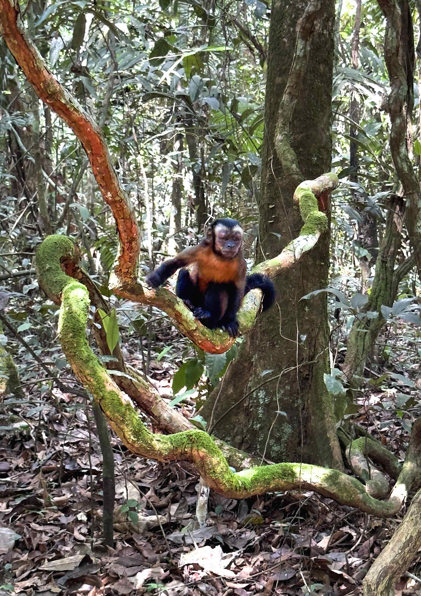

Earlier this summer, I decided to visit a place I had always dreamed about: The Amazon.
I flew from Bogota to Leticia, a small town in the Amazonas department of Colombia.
There, I took a small boat to a tiny outpost in the middle of the jungle, Puerto Nariño,
where I met up with my tour guides from (Oxigeno Amazones)[[https://www.oxigenoamazonas.bokun.website].

I embarked upon a 5 day tour of the Amazon, in what I can only call a life-changing experience.
The first day we had a 5mile hike of the jungle, where I saw many beautiful birds, some monkeys
(from far away, all you can see is the movement of the branches), and endless beautiful insects.

At night, the jungle really comes alive, and the sound of the animals becomes so deafening as to
make sleep difficult. We went on another hike, and saw so many enormous insects, tarantulas, and
frogs. I was hoping to see some vipers, but no luck. I couldn't believe the richness in front of
me the entire time.

So kept going the days--more hikes, more animals. I had a once-in-a-lifetime opportunity to fish
for piranhas (we caught them and returned them promptly to the river) in a piranha nursery. Then,
we jumped into the Amazon and did the one thing I had told myself I wouldn't do: swim in the
piranha-infested Amazon river. The piranhas sure bit, but they were small and didn't do any damage.

All biologists really should consider flying to the Amazon and learning about it. We have so much
molecular knowledge these days, but it is important that we remember that molecular biology is
profoundly intertwined with ecology and the natural world. Evolution, the architect of everything
we study in molecular biology, was first discovered by naturalists studying animal and plant
diversity.

<section style="position:relative">
    

    

        <ul class="glide__slides">
        <li class="glide__slide">
            
        </li>
        <li class="glide__slide">
            
        </li>
        <li class="glide__slide">
            
        </li>
        <li class="glide__slide">
            
        </li>
        <li class="glide__slide">
            
        </li>
        <li class="glide__slide">
            
        </li>
        <li class="glide__slide">
            
        </li>
        <li class="glide__slide">
            
        </li>
        <li class="glide__slide">
            
        </li>
        <li class="glide__slide">
            
        </li>
        </ul>
    

    

        <button class="glide__arrow text-default position-static" data-glide-dir="<"><i class="ni ni-bold-left"></i></button>
        <button class="glide__arrow text-default position-static" data-glide-dir=">"><i class="ni ni-bold-right"></i></button>
    

    

</section>

